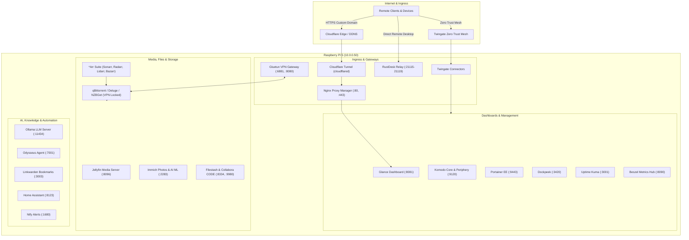

# 🌌 Homelab Infrastructure & GitOps

[](docs/hardware.md)
[](https://www.debian.org/)
[](https://www.docker.com/)
[](docs/hardware.md)
[](docs/networking.md)

An organized, production-grade, modular Homelab repository managing all containerized services, host daemons, orchestration stacks, network routing, and automated maintenance scripts for a high-performance **Raspberry Pi 5 (8GB RAM, 1TB NVMe SSD)** node.

---

## 🏛️ System Architecture



---

## 🧭 Repository Structure

```
.
├── .gitignore                     # Enforces zero leakage of secrets, keys, and databases
├── README.md                      # Primary documentation & architecture index
├── docs/                          # Detailed homelab technical documentation
│   ├── hardware.md                # Raspberry Pi 5 specs, storage subsystems & thermals
│   ├── networking.md              # Ingress routing, VPN kill-switch & Zero Trust
│   ├── services.md                # Complete service registry & port mapping matrix
│   └── disaster-recovery.md       # Step-by-step restoration from scratch
├── scripts/                       # Maintenance, backup & diagnostics automation
│   ├── backup.sh                  # Daily/weekly encrypted archive & retention pruner
│   ├── check-health.sh            # Real-time resource, container & sensor diagnostics
│   ├── setup-environment.sh       # Directory structure & .env initializer
│   └── update-stacks.sh           # Non-destructive container pull & image prune
├── stacks/                        # Modular Docker Compose Stacks
│   ├── ai-and-agents/             # Ollama, Odysseus Agent, OpenJarvis
│   ├── automation/                # Home Assistant, Ntfy Push Notifications
│   ├── bookmarks/                 # Linkwarden, Meilisearch, PostgreSQL
│   ├── dashboards/                # Glance Dashboard + Custom API Widgets & RSS
│   ├── management/                # Komodo, Portainer EE, Dockge, Dockscope, HomeDock OS
│   ├── media/                     # *Arr Stack + Gluetun VPN + Jellyfin + Jellyseerr
│   ├── monitoring/                # Beszel Hub & Agent, Uptime Kuma, Dockpeek
│   ├── networking/                # Nginx Proxy Manager, Cloudflare Tunnel, Twingate, RustDesk
│   ├── photos-and-cloud/          # Immich (with ML & pgvectors), Filestash, Collabora, Copyparty
│   └── security/                  # Authentik SSO & Wazuh SIEM Security Manager
└── systemd/                       # Native host systemd service unit definitions
    ├── code-server.service        # VS Code in Browser (:1606)
    ├── deq.service                # DeQ Server (:5050)
    ├── openjarvis.service         # OpenJarvis AI Service
    ├── wolfnet.service            # WolfNet Private Mesh Daemon
    ├── wolfstack.service          # WolfStack GPU & Remote Server Management
    └── wolfusb.service            # WolfUSB Remote USB Share Daemon
```

---

## ⚡ Quick Start

### 1. Clone & Initialize Environment
```bash
git clone https://github.com/RoeeIlouz/Homelab.git /Home/pi/homelab
cd /Home/pi/homelab

# Make scripts executable and initialize folders / .env templates
chmod +x scripts/*.sh
./scripts/setup-environment.sh
```

### 2. Configure Secrets & Environment Variables
Each stack directory contains an `.env.example` file. Copy and update with your credentials:
```bash
cp stacks/media/.env.example stacks/media/.env
cp stacks/monitoring/.env.example stacks/monitoring/.env
cp stacks/networking/nginx-proxy-manager/.env.example stacks/networking/nginx-proxy-manager/.env
# Edit .env files with your secrets
```

### 3. Launch Desired Stacks
```bash
# Launch Reverse Proxy & Ingress
docker compose -f stacks/networking/nginx-proxy-manager/compose.yaml up -d

# Launch Dashboards & Monitoring
docker compose -f stacks/dashboards/compose.yaml up -d
docker compose -f stacks/monitoring/compose.yaml up -d

# Launch Media Automation Pipeline
docker compose -f stacks/media/compose.yaml up -d
```

---

## 📊 Core Services & Port Map

| Service | Category | Port | URL | Description |
|---|---|---|---|---|
| **Glance** | Dashboard | `8081` | `http://10.0.0.50:8081` | Central homelab dashboard & RSS/weather/markets |
| **Komodo** | Orchestration | `9120` | `http://10.0.0.50:9120` | Multi-stack orchestration & deployment manager |
| **Portainer EE** | Management | `9443` | `https://10.0.0.50:9443` | Container management UI & templates |
| **Nginx Proxy Manager** | Networking | `81` / `80` / `443` | `http://10.0.0.50:81` | Ingress reverse proxy & SSL certificate manager |
| **Jellyfin** | Media | `8096` | `http://10.0.0.50:8096` | Privacy-focused personal streaming server |
| **Jellyseerr** | Media | `5055` | `http://10.0.0.50:5055` | Media request and discovery portal |
| **qBittorrent** | Downloads | `8080` | `http://10.0.0.50:8080` | BitTorrent client strictly bound to Gluetun VPN |
| **Sonarr / Radarr** | Media | `8989` / `7878` | `http://10.0.0.50:8989` | Automated TV & Movie grabbers and organizers |
| **Immich** | Photos | `2283` | `http://10.0.0.50:2283` | Self-hosted Google Photos alternative with ML |
| **Beszel** | Monitoring | `8090` | `http://10.0.0.50:8090` | Lightweight system metrics and sensor hub |
| **Uptime Kuma** | Monitoring | `3001` | `http://10.0.0.50:3001` | Service ping, HTTP latency & health status |
| **Ollama** | AI | `11434` | `http://10.0.0.50:11434` | Local large language model runtime |
| **RustDesk Relay** | Remote Access | `21115-21119` | Direct Client | Self-hosted encrypted remote desktop server |
| **Code Server** | Development | `1606` | `http://10.0.0.50:1606` | Full VS Code IDE accessible via browser |

*For the complete registry of all 30+ services, see [docs/services.md](docs/services.md).*

---

## 🛠️ Automated Operations & Scripts

- **Run Diagnostics**:
  ```bash
  ./scripts/check-health.sh
  ```
- **Update All Containers & Clean Images**:
  ```bash
  ./scripts/update-stacks.sh
  ```
- **Perform Automated Backup**:
  ```bash
  ./scripts/backup.sh
  ```

---

## 🔒 Security & Secrets Management

1. **Zero Secret Policy**: No API keys, WireGuard private keys, database passwords, SSL certificates, or user hashes are ever committed to this Git repository.
2. **Environment Variable Injection**: All Docker Compose configurations rely on `.env` files with strict `.gitignore` rules.
3. **Network Isolation**: Downloaders and scraping tools operate entirely in an isolated network namespace attached to `Gluetun` with a kernel-enforced kill-switch.
4. **Zero Trust Ingress**: Internal management UIs are protected behind Twingate and Cloudflare Access tunnels.

---

## 📜 License

Configured with ❤️ for personal homelab operations. Built on Debian GNU/Linux and open-source software.
