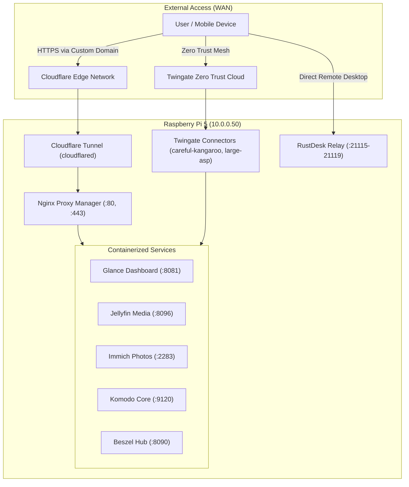

# Networking, Ingress & Security Topology

## Network Addressing & IP Subnets

| Interface | Type | Subnet / Address | Purpose |
|---|---|---|---|
| `eth0` | Gigabit Ethernet | `10.0.0.50/8` | Primary host local area network connection |
| `wolfnet0` | WireGuard Mesh | `10.10.10.50/24` | WolfNet private peer-to-peer encrypted mesh |
| `servarrnetwork` | Docker Bridge | `172.39.0.0/24` | Dedicated private subnet for `*arr` media automation |
| `docker0` | Docker Bridge | `172.17.0.0/16` | Default Docker bridge |

## Ingress & Remote Access Architecture

## VPN & Privacy Routing (Gluetun Kill-Switch)

All high-bandwidth download clients (`qBittorrent`, `Deluge`, `NZBGet`, `Prowlarr`, `FlareSolverr`) route 100% of their egress traffic through the `gluetun` container:
- Protocol: WireGuard
- Provider: AirVPN (or configured provider)
- Forwarded Port: 6881
- Kill-switch: If the VPN tunnel drops, network traffic is instantly blocked at the kernel network namespace level.
- Healing: `deunhealth` container monitors `gluetun` health checks and restarts dependent containers when connectivity is recovered.
